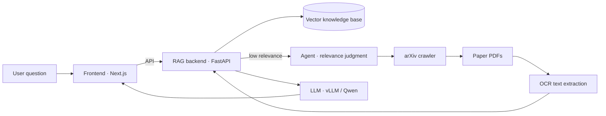
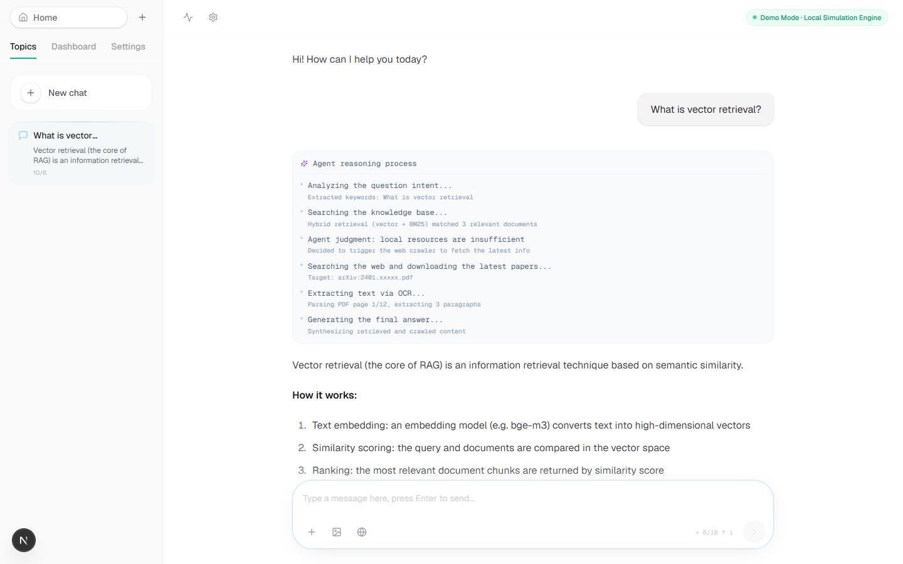
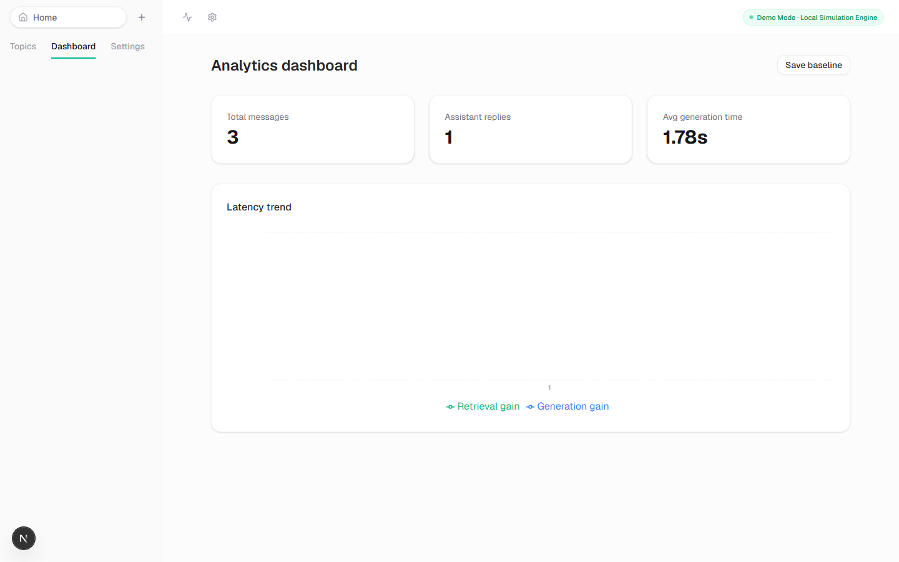

# Multimodal RAG + Agent QA System

An end-to-end **Retrieval-Augmented Generation (RAG)** + **autonomous Agent** question-answering system. When the knowledge base can't answer a question confidently, the agent automatically triggers a web crawler to fetch the latest arXiv papers, extracts text via OCR, and generates an answer with a step-by-step reasoning trace and cited sources.

> **Demo-first**: the frontend runs entirely on its own with a built-in mock engine — no backend, GPU, or API keys required. See [Quick start](#quick-start).

## Highlights

- **Complete agent pipeline** — intent analysis → knowledge-base retrieval → relevance judgment → web crawling → OCR extraction → answer generation
- **Corrective RAG (CRAG)** — query rewriting, sub-question decomposition, and self-correction when retrieval relevance is low
- **Zero-dependency demo mode** — a pure-frontend demo that simulates the full pipeline, so visitors can run it in seconds
- **Analytics dashboard** — retrieval/generation latency, token statistics and trends

## Architecture



## Tech stack

| Module | Technology |
|---|---|
| Frontend | Next.js 16, React 19, TypeScript, Tailwind CSS, shadcn/ui, Recharts |
| RAG backend | FastAPI, LangChain, Hugging Face Transformers, vLLM |
| Crawler | Python, langchain_community ArxivRetriever, requests |
| OCR | PyMuPDF (fitz) |
| Query optimisation | LangChain + DashScope (Qwen) |

## Project structure

```
demo_backup/
├── frontend/           # Next.js frontend (app, components, mock engine, demo backend)
│   ├── app/            # pages & API routes
│   ├── components/     # chat + UI components
│   ├── lib/            # mock task engine (demo mode)
│   └── backend/        # FastAPI demo backend
├── rag/                # RAG backend (FastAPI + LangChain + Transformers + vLLM)
├── crawler/            # arXiv paper crawler
├── ocr/                # PDF text extraction (PyMuPDF)
└── query-relevance/    # query rewriting / relevance judgment (Corrective RAG agent)
```

## Quick start (demo mode)

```bash
cd frontend
npm install
npm run dev          # open http://localhost:3000
```

Demo mode is enabled by default (`DEMO_MODE=true`) and requires no backend, GPU, or API keys.

## Feature demo guide

| Capability | Example prompt |
|---|---|
| Vector retrieval / RAG | `What is vector retrieval?` |
| Multimodal | `Explain multimodal technology` |
| Agent | `How does the agent work?` |
| Web crawler | `How does the crawler fetch the latest papers?` |
| OCR | `How does OCR extract text from documents?` |
| Self-improvement | `What is the self-improvement mechanism?` |

## Connecting the real backend

**1. RAG backend** (requires an NVIDIA GPU + vLLM + an 8B model):

```bash
cd rag
pip install -r requirements.txt
python api_server2.py       # http://localhost:8001
```

**2. Query optimisation / relevance judgment** (requires an Alibaba Cloud DashScope API key):

```bash
cd query-relevance
cp .env.example .env        # fill in DASHSCOPE_API_KEY
python agent.py
```

**3. Point the frontend at the real backend** — edit `frontend/.env.local`, set `DEMO_MODE=false` and uncomment `BACKEND_URL`.

## Security

- All API keys are injected via environment variables / `.env`; the repository contains no real credentials.
- Never commit `.env`; use `.env.example` as a template (`.env` is already gitignored).

## Screenshots

**Chat interface** — ask a question and watch the full agent pipeline (intent analysis → retrieval → judgment → crawling → OCR → generation) stream back in real time.



**Analytics dashboard** — retrieval/generation latency, token statistics and trends.



## License

Distributed under the [MIT License](LICENSE).
